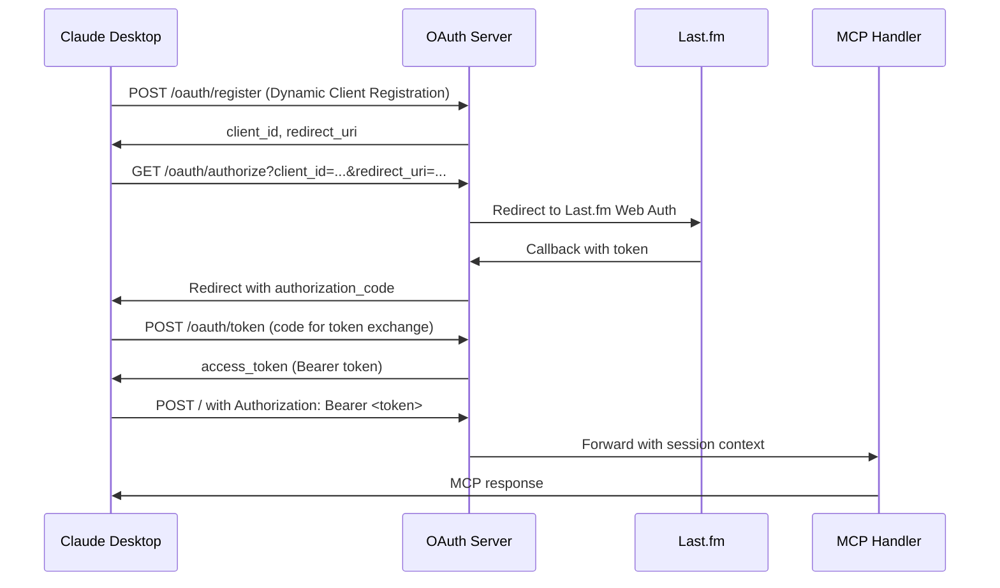

# OAuth 2.0 + MCP Integration: Implementation Learnings

## Overview

This document captures the technical learnings from implementing OAuth 2.0 authentication for a Model Context Protocol (MCP) server designed to work with Claude Desktop's native OAuth support.

## Project Context

**Goal**: Migrate a Last.fm MCP server from `mcp-remote` proxy to native Claude Desktop OAuth integration.

**Architecture**: Cloudflare Worker serving as both OAuth 2.0 provider and MCP server, bridging to Last.fm Web Auth.

**Result**: ✅ Successful OAuth implementation with tools working, ❌ some resources authentication limitations.

## Key Technical Learnings

### 1. Claude Desktop OAuth Expectations

#### ✅ **What Works:**
- **Root Endpoint**: Claude Desktop expects OAuth-authenticated MCP servers at `/` (root), not `/sse`
- **Public Clients**: OAuth clients without `client_secret` work perfectly for MCP use cases
- **Auto-Registration**: Dynamic Client Registration (RFC 7591) enables seamless setup
- **Bearer Tokens**: Standard OAuth Bearer token authentication works for MCP JSON-RPC

#### ❌ **Common Misconceptions:**
- Claude Desktop doesn't use `/sse` endpoint for OAuth servers
- Client secrets are not required for MCP OAuth clients
- SSE transport is not needed for OAuth-authenticated MCP servers

### 2. OAuth 2.0 Implementation Details

#### Required Endpoints:
```typescript
// OAuth 2.0 Authorization Server
POST /oauth/register    // RFC 7591 Dynamic Client Registration
GET  /oauth/authorize   // Authorization endpoint
POST /oauth/token       // Token exchange endpoint

// MCP Protocol
POST /                  // OAuth-protected MCP JSON-RPC endpoint
GET  /                  // Server information (optional)
```

#### Dynamic Client Registration:
```typescript
interface OAuthClient {
  client_id: string
  client_secret: string     // Empty for public clients
  client_name: string
  redirect_uris: string[]
  grant_types: ['authorization_code']
  response_types: ['code']
  scope: string
  created_at: number
}

// Auto-register known clients
if (redirectUri === 'https://claude.ai/api/mcp/auth_callback') {
  // Claude Desktop client
}
```

#### Token Format:
```typescript
interface AccessToken {
  token: string              // Random bearer token
  client_id: string
  user_id: string
  username: string
  lastfm_session_key: string // Bridge to Last.fm
  scope: string
  expires_at: number         // 1 hour TTL
  created_at: number
}
```

### 3. Authentication Flow Architecture



### 4. Last.fm Integration Bridge

#### Challenge:
Last.fm uses its own Web Auth system, not OAuth 2.0.

#### Solution:
Create a bridge that maps OAuth flow to Last.fm auth:

```typescript
// OAuth authorization redirects to Last.fm
const lastfmAuthUrl = `https://www.last.fm/api/auth/?api_key=${apiKey}&cb=${callbackUrl}`

// Last.fm callback exchanges for session key
const sessionResponse = await lastfm.getSession(token)

// Store mapping in OAuth token
const accessToken: AccessToken = {
  token: generateSecureId(),
  username: sessionResponse.session.name,
  lastfm_session_key: sessionResponse.session.key,
  // ... other OAuth fields
}
```

### 5. MCP Protocol Integration

#### Session Context Mapping:
```typescript
// Convert OAuth token to MCP session format
async function getConnectionSession(request: Request): Promise<SessionPayload | null> {
  const authHeader = request.headers.get('Authorization')
  if (authHeader?.startsWith('Bearer ')) {
    const token = authHeader.substring(7)
    const tokenData = await storage.get(`oauth:token:${token}`)
    
    if (tokenData) {
      const parsedTokenData = JSON.parse(tokenData)
      return {
        userId: parsedTokenData.username,
        sessionKey: parsedTokenData.lastfm_session_key,
        username: parsedTokenData.username,
        iat: Math.floor(Date.now() / 1000),
        exp: Math.floor(parsedTokenData.expires_at / 1000),
      }
    }
  }
  return null
}
```

#### MCP Handler Updates:
```typescript
// Remove JWT dependencies
export async function handleMethod(
  request: JSONRPCRequest, 
  httpRequest?: Request, 
  jwtSecret?: string,  // Now optional
  env?: Env
) {
  // Use OAuth session instead of JWT
  const session = await getConnectionSession(httpRequest, undefined, env)
  // ... rest of handler
}
```

### 6. Architecture Decisions

#### ✅ **Successful Patterns:**

1. **Pure OAuth Implementation**
   - Remove all JWT dependencies
   - Single authentication mechanism
   - Cleaner codebase

2. **Auto-Registration**
   - Detect Claude Desktop by redirect URI
   - Automatically register public clients
   - No manual client setup required

3. **Root Endpoint Strategy**
   - Serve MCP at `/` for OAuth compatibility
   - Keep `/sse` for legacy mcp-remote support
   - Clear separation of concerns

4. **Stateless Token Design**
   - Store complete session data in token
   - No server-side session management
   - Cloudflare KV for token storage

#### ❌ **Problematic Patterns:**

1. **Hybrid Authentication**
   - Mixing JWT and OAuth causes complexity
   - Authentication context confusion
   - Hard to debug issues

2. **SSE for OAuth**
   - Claude Desktop doesn't expect SSE for OAuth servers
   - Transport layer confusion
   - Unnecessary complexity

3. **Client Secret Requirements**
   - Public clients work fine for MCP
   - Adds unnecessary security complexity
   - Not required by OAuth 2.0 spec

### 7. Known Limitations & Solutions

#### ❌ **Resources Authentication Context**

**Problem**: MCP resources may not receive proper authentication context, causing "Missing authentication context" errors.

**Potential Solutions**:
```typescript
// 1. Enhanced session passing
case 'resources/read': {
  const session = await getConnectionSession(httpRequest, undefined, env)
  if (!session) {
    return createError(id!, MCPErrorCode.Unauthorized, 'Authentication required for resources')
  }
  const result = await handleResourcesRead(params, session, env)
  return hasId(request) ? createResponse(id!, result) : null
}

// 2. Better error handling
if (!httpRequest) {
  // More specific error messages
  return createError(id!, -32603, 'HTTP request context required for authenticated operations')
}
```

#### ⚠️ **Architecture Complexity**

**Challenge**: OAuth → Last.fm → Bearer Token → MCP creates a complex chain.

**Mitigation Strategies**:
- Comprehensive logging at each step
- Clear error messages with troubleshooting hints
- Fallback mechanisms where appropriate
- Documentation of the full flow

### 8. Testing & Validation

#### MCP Inspector Testing:
```bash
# Test OAuth flow
curl -X POST https://server.com/oauth/register \
  -H "Content-Type: application/json" \
  -d '{"redirect_uris":["http://localhost:3000/callback"]}'

# Test authenticated tools
curl -X POST https://server.com/ \
  -H "Authorization: Bearer <token>" \
  -H "Content-Type: application/json" \
  -d '{"jsonrpc":"2.0","id":1,"method":"tools/call","params":{"name":"ping"}}'
```

#### Claude Desktop Integration:
1. Add server URL to Claude Desktop MCP settings
2. Claude automatically discovers OAuth capabilities
3. User completes OAuth flow in browser
4. Claude receives Bearer token for API calls

### 9. Performance Considerations

#### Caching Strategy:
```typescript
// Cache OAuth tokens with TTL
await env.MCP_SESSIONS.put(
  `oauth:token:${accessToken}`,
  JSON.stringify(tokenData),
  { expirationTtl: 3600 } // 1 hour
)

// Cache Last.fm API responses
const cachedResponse = await env.MCP_SESSIONS.get(`lastfm:cache:${cacheKey}`)
```

#### Rate Limiting:
```typescript
// OAuth endpoints need rate limiting
const rateLimiter = new RateLimiter(env.MCP_RL, {
  requestsPerMinute: 60,
  requestsPerHour: 1000,
})
```

### 10. Security Considerations

#### Token Security:
- ✅ Generate cryptographically secure tokens
- ✅ Short token lifetime (1 hour)
- ✅ Secure storage in Cloudflare KV
- ✅ No sensitive data in tokens

#### CORS Configuration:
```typescript
function corsHeaders(headers: HeadersInit = {}): HeadersInit {
  return {
    'Access-Control-Allow-Origin': '*',
    'Access-Control-Allow-Methods': 'GET, POST, OPTIONS',
    'Access-Control-Allow-Headers': 'Content-Type, Authorization',
    'Access-Control-Max-Age': '86400',
    ...headers
  }
}
```

## Conclusion

OAuth 2.0 integration with MCP is achievable and provides a clean, standards-based authentication mechanism. The key insights are:

1. **Claude Desktop expects OAuth servers at root endpoint**
2. **Public OAuth clients work perfectly for MCP use cases**  
3. **Dynamic Client Registration enables seamless setup**
4. **JWT-free architecture is cleaner and more maintainable**
5. **Resources authentication requires more attention than tools**

The implementation demonstrates successful OAuth integration with MCP, providing a foundation for other projects attempting similar integration.

## References

- [RFC 6749: OAuth 2.0 Authorization Framework](https://tools.ietf.org/html/rfc6749)
- [RFC 7591: Dynamic Client Registration](https://tools.ietf.org/html/rfc7591)
- [Model Context Protocol Specification](https://spec.modelcontextprotocol.io/)
- [Claude Desktop MCP Integration Guide](https://docs.anthropic.com/en/docs/build-with-claude/mcp)
- [Last.fm Web API Documentation](https://www.last.fm/api)

---

*This document represents learnings from a successful OAuth 2.0 + MCP integration project completed in June 2025.*